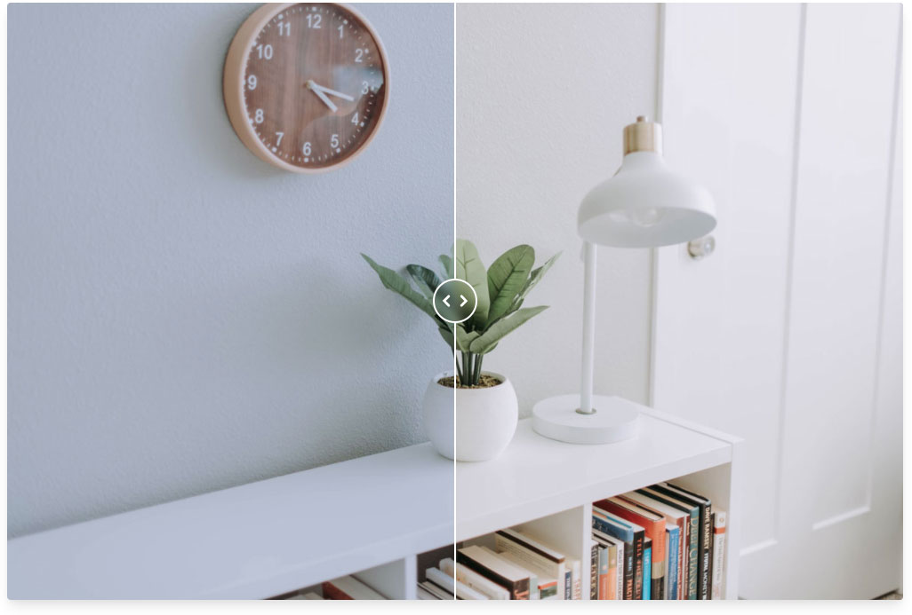

A fully responsive slider to compare before and after images for grading, retouching and all else. Mobile and fluid container friendly! [Check out live examples](https://image-compare-viewer.netlify.com/)




### Installation

```
npm install image-compare-viewer --save
```

Stylesheet is available at "node_modules/image-compare-viewer/src/styles/index.scss" or "node_modules/image-compare-viewer/dist/image-compare-viewer.min.css"

### CDN

#### Javascript

```
<script src="https://unpkg.com/image-compare-viewer/dist/image-compare-viewer.min.js"></script>
```

#### CSS

```
<link type="text/css" href="https://unpkg.com/image-compare-viewer/dist/image-compare-viewer.min.css">
```

### Documentation

[Installation, usage, options and examples](https://image-compare-viewer.netlify.com/)
